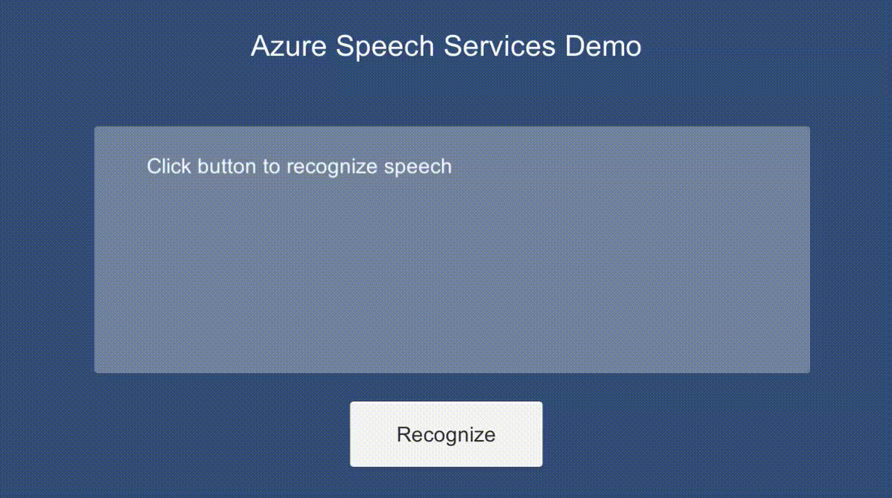
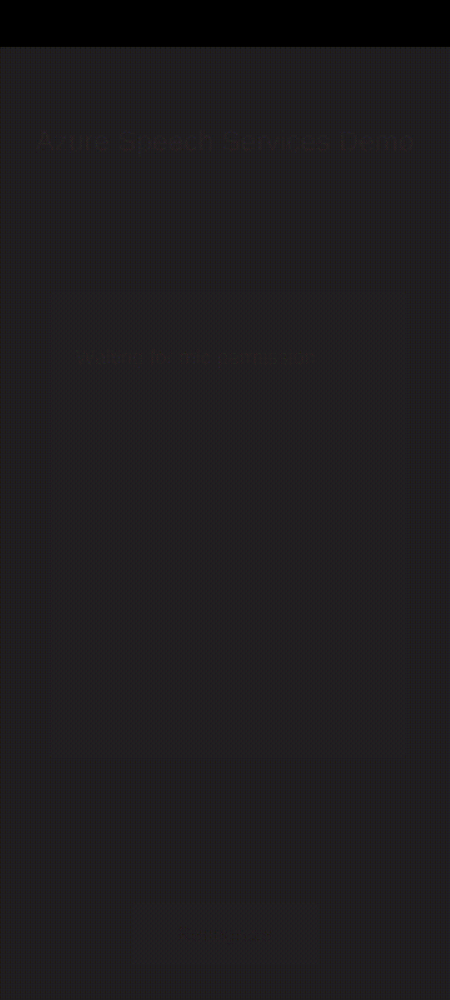

# Quickstart: Recognize speech from a microphone in Unity using the Speech SDK for Unity

This sample demonstrates how to recognize speech in [Unity](https://unity3d.com/).

> Note:
> The Speech SDK for Unity supports Windows Desktop (x86 and x64) or Universal Windows Platform (x86, x64, ARM/ARM64), Android (x86, ARM32/64), iOS (x64 simulator, ARM64), Mac (x64) and Linux (x64).

## Prerequisites

* This sample is targeted for Unity 2019.4 or later. To install, pick an appropriate option in the [Unity store](https://store.unity.com/).
  > Note:
  > If you are not familiar with Unity, it is recommended to study the [Unity User Manual](https://docs.unity3d.com/Manual/UnityManual.html) before starting your app development.
* A subscription key for the Speech service. See [Try the speech service for free](https://docs.microsoft.com/azure/cognitive-services/speech-service/get-started).
* A Windows PC with Windows 10 Fall Creators Update (10.0; Build 16299) or later and with a working microphone.
* A Mac device with Xcode and Unity installed for iOS development.
* [Microsoft Visual Studio 2019](https://www.visualstudio.com/), Community Edition or higher.
* Access to your computer's microphone.
* To target Android: an Android device (ARM32/64, x86; API 23: Android 6.0 Marshmallow or higher) [enabled for development](https://developer.android.com/studio/debug/dev-options) with a working microphone.
* To target iOS: an iOS device (ARM64) [enabled for development](https://learn.unity.com/tutorial/building-for-mobile) with a working microphone.

## Download the Speech SDK for Unity and the sample code

* **By downloading the Speech SDK for Unity you acknowledge its license, see [Speech SDK license agreement](https://aka.ms/csspeech/license201809).**
* The Speech SDK for Unity is packaged as a Unity asset package (.unitypackage).
  Download it from [here](https://aka.ms/csspeech/unitypackage).
* Also, [download the sample code to your development PC.](/README.md#get-the-samples)

## Prepare the sample

* Open the sample project in Unity:
  * Start Unity. In the launch window, under the **Projects** tab select **Open**.
  * Select the folder which contains this sample.
  * After a bit of time, the Unity Editor window should pop up.
    > Note: do not worry about the error  `The type or namespace name
    > 'CognitiveServices' does not exist in the namespace 'Microsoft' (are you
    > missing an assembly reference?)` after opening the sample. This error
    > gets resolved in the next step by importing the Speech SDK.
* Import the Speech SDK:
  * Import the Speech SDK by selecting **Assets** > **Import Package** > **Custom Package**.
  * In the file picker, select the Speech SDK .unitypackage file that you downloaded before.
  * Ensure that all files are selected and click **Import**.
  * NOTE: If you have installed Unity only for specific platform e.g. Unity CloudBuild for Android, be aware that you may need to remove other 
  * platform (iOS, Mac, WSA) binaries from the Speech SDK Plugins folder to avoid possible conflicts with the same library name.
* Select the `HelloWorld` sample scene:
  * In the Project Window (bottom left by default), navigate to **Assets** > **Scenes** and double-click on the `HelloWorld` scene to open it up.
* Update the sample code with your subscription data:
  * In the Project Window, navigate to **Assets** > **Scripts** and double-click the `HelloWorld` C# script to edit it.
    Note: you can configure which code editor will be launched under **Edit** > **Preferences**, for details see [here](https://docs.unity3d.com/Manual/Preferences.html).
  * Do the following edits:
    * Replace the string `YourSubscriptionKey` with your own subscription key.
    * Replace the string `YourServiceRegion` with the service region of your subscription. For example, replace with `westus` if you are using the 30-day free trial subscription.
    * Save the file.

> Note:
> the HelloWorld C# script is used as a component of the canvas object in the HelloWorld scene.

## Run the sample

There are various options to run this sample.
Start by running it in the Unity Editor (first option), then explore other options depending on your needs.

### Run the sample in the Unity Editor

* Press the **Play** button in the Unity Editor toolbar (below the menu bar).
  * In the Unity Editor's Game Window, click the button and speak an English phrase or sentence into your device's microphone. Your speech is transmitted to the Speech service and transcribed to text, which appears in the window.
  * Check also the [Console Window](https://docs.unity3d.com/Manual/Console.html) for debug messages.
* Click the **Play** button again to stop running the app.

### Build and run the sample as a stand-alone desktop application

* Open **File** > **Build Settings**.
* Select **PC, Mac & Linux Standalone** as platform.
* If this wasn't the active platform before, you have to select **Switch Platform** (and wait a bit).
* Ensure the **Target Platform** field is set to **Windows** and pick the option you need from the **Architecture** field.
* Select **Build**.
* In the folder picker, create and select a new build folder.
* Once the build has finished, the Windows Explorer launches with the folder containing the application `HelloWorld.exe`. **Do not launch it yet**
* Navigate to the `HelloWorld_Data/Plugins` folder in your build output folder. Copy the DLL `Microsoft.CognitiveServices.Speech.core.dll` into the `HelloWorld_Data/Managed` folder.
* Double-click on `HelloWorld.exe` in the build output folder to start the application.
* Then, click the button and speak an English phrase or sentence into your device's microphone. Your speech is transmitted to the Speech service and transcribed to text, which appears in the window.

### Build and run the sample as Universal Windows Platform application

* Open **File** > **Build Settings**.
* Select **Universal Windows Platform** as platform.
* If this wasn't the active platform before, you have to select **Switch Platform** (and wait a bit).
* Ensure that **Target Platform** and **Architecture** are set appropriately.
* Click **Player Settings...** to open them up in the Inspector Window (on the right by default).
* Navigate to the section **Other Settings** in the **Settings for Universal Windows Platform** tab:
  * Select **.NET 4.x Equivalent** as **Scripting Runtime Version**.
  * Select **IL2CPP** as **Scripting Backend**.
* In the section **Publishing Settings**, review that checkmarks are set for the these capabilities in the **Capabilities** control:
  * `InternetClient`
  * `InternetClientServer`
  * `Microphone`
* Back in the **Build Settings** window, click **Build And Run**.
  * For Windows ARM64 architecture, choose **Build** and then load the solution file to build for ARM64 and deploy your package to your device.
    You may hit build error "MSB3273" for the UnityPlayer.dll ImageFileMachine value of "0xAA64". To suppress this you can edit the generated HelloWorld.vcxproj and add "\<ResolveAssemblyWarnOrErrorOnTargetArchitectureMismatch>None\</ResolveAssemblyWarnOrErrorOnTargetArchitectureMismatch>" to the "Global" property group. For more information see this [StackOverflow article](https://stackoverflow.com/questions/10113532/how-do-i-fix-the-visual-studio-compile-error-mismatch-between-processor-archit).
* In the folder picker, create and select a new folder.
* After the build completes, the UWP app launches:
  * When you see the `Enable microphone` button, click it.
  * Then, click the button and speak an English phrase or sentence into your device's microphone. Your speech is transmitted to the Speech service and transcribed to text, which appears in the window.

### Build and run the sample for Android platform

* Complete your [Android environment setup in Unity](https://docs.unity3d.com/Manual/android-sdksetup.html), including the Android NDK setup.
* Open **File** > **Build Settings**.
* Select **Android** as platform.
* If this wasn't the active platform before, you have to select **Switch Platform** (and wait a bit).
* Click **Player Settings...** to open them up in the Inspector Window (on the right by default).
* Navigate to the **Other Settings** of the **Settings for Android** tab.
* Review the information under **Identification** and **Configuration** and make sure they are correct for your environment, in particular:
  * **Minimum API Level**
  * **Target API Level**
  * **Scripting Runtime Version** (set to **.NET 4.x**)
  * **Scripting Backend** (set to **IL2CPP**)
  * **Target Architectures**
* Connect your [developer-enabled](https://developer.android.com/studio/debug/dev-options) Android device to your PC via USB.
* Back in the **Build Settings** window, click **Build And Run**.
* After the build completes, the app launches on your Android device:
  * When you see the prompt asking for microphone permission, agree to it.
  * Then, click the button and speak an English phrase or sentence into your device's microphone. Your speech is transmitted to the Speech service and transcribed to text, which appears in the window.

### Build and run the sample for iOS platform

* [Get started on iOS environment setup in Unity](https://docs.unity3d.com/Manual/iphone-GettingStarted.html), and prepare iPhone device for development.
* Open this Unity sample project on Mac. 
* Under **Project** > **Assets** > **SpeechSDK** > **Plugins** > **iOS**, check that `Microsoft.CognitiveServices.Speech.csharp.dll` target is enabled for `Editor` and `iOS` platforms.
* Open **File** > **Build Settings**,
* Select **iOS** as platform.
* If this wasn't the active platform before, you have to select **Switch Platform** (and wait a bit).
* Click **Player Settings...** to open them up in the Inspector Window (on the right by default).
* Check that under **Other Settings**, `Bundle Identifier`, `Version` and `Target minimum iOS Version` matches with your Apple device provisioning profile.
* Check that under **Other Settings**, `Microphone usage description` has a description entered.
  > Note: Some iOS configurations may require the checkbox `Prepare iOS for recording` to be enabled to allow microphone input on device.
* Back in the **Build Settings** window, click **Build** and create a new folder where Xcode project will be generated by Unity.
* After the build has completed, open created Xcode project with your Xcode editor.
* In Xcode, under **Targets** > **Unity-Phone** > **General**, check that `Identity` and `Signing` matches with your provisioning profile.
  > Note: Bitcode is enabled in the iOS plugin.
* Connect your [developer-enabled](https://learn.unity.com/tutorial/building-for-mobile) iOS device to your Mac via USB and select that as a target in Xcode.
* In Xcode, build and run the solution using `Play` button.
  * When you see the prompt asking for microphone permission, agree to it.
  * Then, click the button and speak an English phrase or sentence into your device's microphone. Your speech is transmitted to the Speech service and transcribed to text, which appears in the window.

  ### Build and run the sample for MacOS platform

* [Get started on MacOS environment setup in Unity](https://docs.unity3d.com/Manual/AppleMac.html).
* Under **Project** > **Assets** > **SpeechSDK** > **Plugins** > **MacOS**, check that `Microsoft.CognitiveServices.Speech.csharp.dll` target is enabled for `Editor` and `Standalone` and `MacOS` platforms.
* Open **File** > **Build Settings**,
* Select **PC, Mac & Linux Standalone** as platform.
* If this wasn't the active platform before, you have to select **Switch Platform** (and wait a bit).
* Click **Player Settings...** to open them up in the Inspector Window (on the right by default).
* Check that under **Other Settings**, `Microphone usage description` is updated with the `This app requires microphone access`.
* Back in the **Build Settings** window, click **Build** and create a new of the standalone app which will be generated by Unity.
* After the build has completed, open created standalone application and launch it for the speech experience.

  ### Build and run the sample for Linux platform

* [Get started on Linux environment setup in Unity](https://docs.unity3d.com/Manual/linux.html).
* Under **Project** > **Assets** > **SpeechSDK** > **Plugins** > **Linux**, check that `Microsoft.CognitiveServices.Speech.csharp.dll` target is enabled for `Editor` and `Standalone` and `Linux` platforms.
* Open **File** > **Build Settings**,
* Select **PC, Mac & Linux Standalone** as platform.
* If this wasn't the active platform before, you have to select **Switch Platform** (and wait a bit).
* Back in the **Build Settings** window, click **Build** and create a new of the standalone app which will be generated by Unity.
* After the build has completed, open created standalone application and launch it for the speech experience.

## References

* [Quickstart article on the SDK documentation site](https://docs.microsoft.com/azure/cognitive-services/speech-service/quickstart-csharp-unity)
* [Speech SDK API reference for C#](https://aka.ms/csspeech/csharpref)
